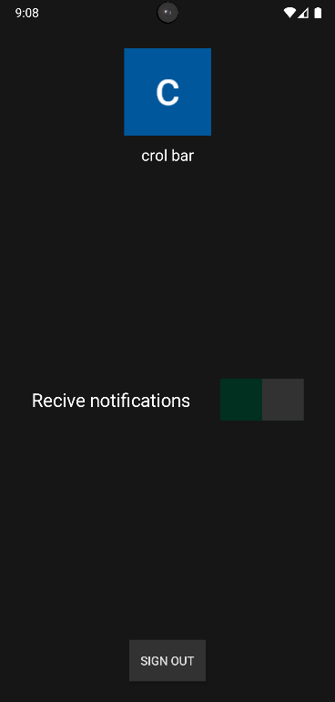

# Yet Another TODO App

> [!NOTE]
> It is absolutely possible that something won't work.
> Also there may be some delays because of the backend system's startup time.

## Features
- create/edit/delete tasks with start and end times
- weekly view
- google OAth
- zero dependancies (plain php + a bit js for ajax)
- tailwind for styles
- mobile notifiyer app used just for sending notifications (APK available in releases)

### Notes for the mobile notifications
- you have to login with the same account as you did in the web ui
- tasks created prior to loging in and enabling notifications in the mobile notifiyer will not trigger notifications on start time
- notifications are send with cron jobs so you should recieve them a bit after your set start time for the task
- you should be prompted to enable notifications, if not make sure they are enabled for the app
